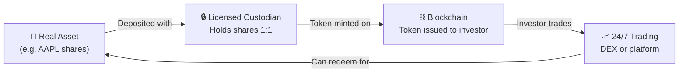

<!-- PROJECT SHIELDS -->
[![Research Status][status-shield]][status-url]
[![Last Updated][updated-shield]][updated-url]
[![Author][author-shield]][author-url]

 

  <h1>Tokenized Securities & BlackRock BUIDL</h1>
  

    A deep-dive research report on crypto stock tokens, BlackRock's tokenized treasury fund, and what it all means for retail investors.
  

  
<em>Prepared by HX · April 12, 2026</em>

 

---

<!-- TABLE OF CONTENTS -->

  
<strong>Table of Contents</strong>

   
  <ol>
    <li><a href="#executive-summary">Executive Summary</a></li>
    <li>
      <a href="#what-are-tokenized-securities">What Are Tokenized Securities?</a>
      <ul>
        <li><a href="#definition">Definition</a></li>
        <li><a href="#how-it-works">How It Works</a></li>
        <li><a href="#types-of-tokenization-models">Types of Tokenization Models</a></li>
      </ul>
    </li>
    <li>
      <a href="#blackrock-buidl-fund">BlackRock BUIDL Fund</a>
      <ul>
        <li><a href="#what-is-buidl">What Is BUIDL?</a></li>
        <li><a href="#key-milestones">Key Milestones</a></li>
        <li><a href="#how-buidl-works">How BUIDL Works</a></li>
      </ul>
    </li>
    <li>
      <a href="#blackrock-tokenized-stock-strategy">BlackRock Tokenized Stock Strategy</a>
      <ul>
        <li><a href="#larry-finks-vision">Larry Fink's Vision</a></li>
        <li><a href="#nyse--securitize-partnership">NYSE × Securitize Partnership</a></li>
      </ul>
    </li>
    <li><a href="#tokenized-stocks-vs-traditional-stocks">Tokenized Stocks vs. Traditional Stocks</a></li>
    <li><a href="#recent-news--timeline">Recent News & Timeline</a></li>
    <li>
      <a href="#retail-investor-playbook">Retail Investor Playbook</a>
      <ul>
        <li><a href="#platforms-to-watch">Platforms to Watch</a></li>
        <li><a href="#opportunity-areas">Opportunity Areas</a></li>
        <li><a href="#risks-to-understand">Risks to Understand</a></li>
      </ul>
    </li>
    <li><a href="#further-reading">Further Reading</a></li>
    <li><a href="#sources">Sources</a></li>
  </ol>

 

---

 

## Executive Summary

Tokenized securities — digital representations of real-world financial assets recorded on a blockchain — are having a breakout year in 2026. The market almost quadrupled through 2025 to nearly **$20 billion**, and tokenized equities alone have already crossed the **$900 million** threshold in 2026.

BlackRock, the world's largest asset manager ($11.6T AUM), is leading the charge with its **BUIDL fund** (a $2.85B tokenized U.S. Treasury money market fund) and is backing infrastructure that could bring 24/7 tokenized stock trading to the NYSE by late 2026.

For retail investors, this is a shift worth paying attention to: fractional ownership, instant settlement, 24/7 trading, and global access are no longer theoretical — they're being built right now by the biggest names in finance.

 

(<a href="#readme-top">back to top</a>)

---

 

## What Are Tokenized Securities?

### Definition

A **tokenized security** is a financial instrument that meets the definition of a "security" under federal securities laws but is formatted as — or represented by — a crypto asset, with ownership records maintained on one or more blockchain networks.

In simpler terms: take a traditional stock, bond, or fund share, and represent it as a digital token on a blockchain. Each token corresponds to a specific equity (like Apple or Tesla) and reflects the stock's real-time market price.

 

### How It Works

**The 4-step lifecycle:**

> **Step 1 — Backing:** A licensed custodian purchases and holds the underlying asset (e.g., real shares of Apple stock).
>
> **Step 2 — Minting:** A corresponding token is minted on a blockchain (Ethereum, Solana, Arbitrum, etc.), representing a claim on that asset.
>
> **Step 3 — Trading:** Investors buy, sell, and transfer the token on-chain. The token price tracks the underlying asset.
>
> **Step 4 — Redemption:** Tokens can be redeemed for the underlying asset or its cash equivalent through the issuer.

 

### Types of Tokenization Models

| Model | Description | Ownership Rights | Example |
|:------|:------------|:-----------------|:--------|
| **Native Issuance** | Security is issued directly on-chain as the official record | Full shareholder rights (dividends, voting) | Securitize |
| **Wrapped / Synthetic** | Off-chain shares held by custodian; on-chain token represents a claim | Varies — some have no voting rights | Backed Finance |
| **Derivative Contract** | Token is a derivative contract priced at the underlying asset | No direct ownership — it's a contract | Robinhood EU Stock Tokens |

 

(<a href="#readme-top">back to top</a>)

---

 

## BlackRock BUIDL Fund

### What Is BUIDL?

**BUIDL** (BlackRock USD Institutional Digital Liquidity Fund) is a **$2.85 billion** tokenized money market fund that invests in U.S. Treasury bills and repurchase agreements. It brings real-world assets (RWA) like U.S. Treasuries onto the blockchain through tokenization, making them composable with the broader DeFi ecosystem.

BUIDL is managed by BlackRock and issued through **Securitize**, a digital asset securities firm that BlackRock has invested in directly.

 

### Key Milestones

| Date | Milestone |
|:-----|:----------|
| **Mar 2024** | BUIDL launched on Ethereum via Securitize |
| **Late 2025** | Expanded to BNB Chain; listed as collateral on Binance |
| **Dec 2025** | Surpassed **$2B** in total asset value; distributed ~$100M in dividends since launch |
| **Feb 2026** | Listed on **Uniswap** for on-chain DeFi trading; BlackRock purchased UNI tokens |
| **Mar 2026** | Added **Chronicle** oracle for independent on-chain verification of fund holdings |

 

### How BUIDL Works

BUIDL operates as a traditional money market fund on the backend, but with a blockchain-based front end:

> **Yield** — The fund earns yield from U.S. Treasury bills and repos, distributing dividends to token holders.

> **Stablecoin Integration** — Pre-qualified investors can swap BUIDL tokens for stablecoins (like USDC) 24/7 via DeFi protocols like Uniswap.

> **Collateral Use** — BUIDL tokens can be used as collateral on exchanges like Binance, meaning investors earn yield while their capital remains productively deployed.

> **Verification** — Chronicle's "Proof of Asset" system continuously attests to the fund's holdings, providing real-time transparency that traditional money market funds don't offer.

 

> [!IMPORTANT]
> **Why it matters:** BUIDL is proof that the world's largest asset manager sees blockchain not as a speculative playground, but as superior financial infrastructure.

 

(<a href="#readme-top">back to top</a>)

---

 

## BlackRock Tokenized Stock Strategy

### Larry Fink's Vision

In his **March 2026 annual shareholder letter**, BlackRock CEO Larry Fink argued that tokenization and digital assets could modernize the financial system the way the internet modernized communication. He stated that recording asset ownership on digital ledgers and using regulated digital wallets could make issuing, trading, and accessing investments **faster, cheaper, and more widely available**.

BlackRock has identified crypto and tokenization as **key investment themes driving markets in 2026**.

 

### NYSE × Securitize Partnership

On **March 24, 2026**, the New York Stock Exchange announced a partnership with **Securitize** (BlackRock-backed) to build a **Digital Trading Platform** for tokenized securities.

What the platform aims to deliver:

> - **24/7 trading** of U.S.-listed equities and ETFs
> - **Instant (T+0) settlement** on blockchain
> - **Stablecoin-based funding** — no need for traditional bank wires
> - **Fractional share purchases**
> - **Pilot program** with select institutional clients in **Q3 2026**
> - Full launch pending **SEC and FINRA approval**, targeting **late 2026**

Separately, **Nasdaq** has already won SEC approval to move certain stocks on-chain, signaling that both major U.S. exchanges are racing toward tokenized infrastructure.

 

(<a href="#readme-top">back to top</a>)

---

 

## Tokenized Stocks vs. Traditional Stocks

| Feature | Traditional Stocks | Tokenized Stocks |
|:--------|:-------------------|:-----------------|
| **Trading Hours** | Mon–Fri, 9:30am–4pm ET | 24/7/365 |
| **Settlement** | T+1 (next business day) | T+0 (instant) |
| **Fractional Shares** | Limited broker support | Native — buy $1 of any stock |
| **Global Access** | Requires international brokerage | Crypto wallet + internet |
| **Ownership Record** | Central depository (DTCC) | Blockchain (on-chain) |
| **Dividends & Voting** | Yes (standard) | Depends on model |
| **Transaction Costs** | Broker commissions, clearing fees | Gas fees + platform fees (often lower) |
| **Counterparty Risk** | Broker / clearing house | Custodian + smart contract |
| **Regulation** | Highly mature (100+ years) | Evolving — SEC clarified Jan 2026 |
| **Liquidity** | Deep, centralized order books | Growing but fragmented |

 

> [!NOTE]
> **The Bottom Line:** Tokenized stocks and traditional equities are **complementary**, not substitutes — at least for now. Traditional stocks offer mature regulation, deep liquidity, and full shareholder rights. Tokenized stocks offer accessibility, speed, and composability with DeFi. The convergence is happening fast: by late 2026, the NYSE itself may be running tokenized stock trades.

 

(<a href="#readme-top">back to top</a>)

---

 

## Recent News & Timeline

| Date | Event | Significance |
|:-----|:------|:-------------|
| **Jan 2026** | SEC publishes playbook for tokenized securities | Regulatory clarity — tokenized securities = securities |
| **Jan 2026** | BlackRock 2026 Outlook names tokenization as key theme | World's largest asset manager going all-in |
| **Jan 2026** | CoinDesk: tokenized assets could be a **$400B market** | Massive growth projection from ~$20B |
| **Feb 2026** | BlackRock BUIDL goes live on **Uniswap** | First major institutional fund on a DEX; UNI +25% |
| **Mar 2026** | Fortune: tokenized stocks = **"next big thing in crypto"** | Mainstream media catching on |
| **Mar 2026** | Nasdaq wins SEC approval for on-chain stocks | First major exchange with regulatory green light |
| **Mar 2026** | NYSE × Securitize for tokenized trading platform | 24/7 stock trading with instant settlement |
| **Mar 2026** | Larry Fink shareholder letter champions tokenization | Compares impact to the internet |
| **Mar 2026** | IMF warns about tokenization vulnerabilities | Important counterpoint — new tech, new risks |

 

(<a href="#readme-top">back to top</a>)

---

 

## Retail Investor Playbook

### Platforms to Watch

| Platform | What They Offer | Availability | Key Detail |
|:---------|:----------------|:-------------|:-----------|
| **Securitize** | Natively tokenized stocks with full shareholder rights | U.S. + Global | BlackRock-backed; NYSE partner |
| **Robinhood** | Tokenized U.S. stocks on Arbitrum | EU only (for now) | Derivative contracts — no voting rights |
| **Coinbase** | Tokenized stock trading | U.S. (late 2025) | Largest U.S. crypto exchange |
| **Backed Finance** | Wrapped tokenized equities (bTokens) | Global (non-U.S.) | 1:1 backed in Swiss custody |
| **Dinari** | Tokenized stocks via dShares | U.S. + Global | SEC-compliant; 1:1 backed |

 

### Opportunity Areas

Here are specific areas worth further research for retail investors looking to position early:

 

> **1. Infrastructure Plays (Picks-and-Shovels)**
>
> The companies building the rails for tokenized securities could be big winners regardless of which tokens succeed. Key names: **Securitize** (private, BlackRock-backed), **Chainlink** (LINK — oracle infrastructure used by BUIDL), **Chronicle** (verification layer), and **Coinbase (COIN)** at the intersection of crypto and TradFi.

 

> **2. DeFi Protocols That Win Institutional Flow**
>
> BlackRock listing BUIDL on **Uniswap** sent UNI up 25% in a day. As more institutional products enter DeFi, the protocols that capture that volume — Uniswap, Aave, and others — could see significant value accrual. Watch for which protocols get whitelisted for institutional use.

 

> **3. Stablecoin Ecosystem**
>
> Tokenized stock platforms are built on stablecoin rails. The NYSE Digital Trading Platform plans stablecoin-based funding. Issuers like **Circle (USDC)** and **Tether (USDT)**, plus chains optimized for stablecoin transfers, could benefit.

 

> **4. Layer-2 and Chain Plays**
>
> Tokenized stocks are launching on **Ethereum**, **Arbitrum**, **Solana**, and **BNB Chain**. Whichever chains capture the most tokenized equity volume will see increased fees and ecosystem growth. Arbitrum is notable — Robinhood chose it, and it's becoming a hub for institutional DeFi.

 

> **5. Tokenized Treasury / Yield Products**
>
> For lower-risk exposure, tokenized Treasury products like BUIDL offer real U.S. Treasury yield on-chain. While BUIDL requires institutional minimums, competitors like **Ondo Finance (ONDO)**, **Maple Finance**, and **Mountain Protocol** offer more accessible entry points.

 

### Risks to Understand

> [!CAUTION]
> Before diving in, be aware of these real risks:
>
> - **Custodial Risk** — Most tokenized stocks rely on a centralized custodian. If the custodian fails, your tokens could be at risk.
> - **Smart Contract Risk** — Bugs or exploits in smart contracts could lead to loss of funds.
> - **Liquidity Fragmentation** — Thin order books compared to traditional exchanges can mean wider spreads.
> - **Regulatory Whiplash** — Rules are still evolving despite recent SEC clarity.
> - **Not All Tokens Are Equal** — One platform may give full ownership; another is just a derivative. Always check the legal structure.
> - **IMF Warning (Mar 2026)** — The IMF cautioned that tokenization introduces new systemic vulnerabilities, including operational risks around custody, chain congestion, and off-chain dependencies.

 

(<a href="#readme-top">back to top</a>)

---

 

## Further Reading

These are rabbit holes worth exploring if you want to go deeper:

| Resource | Why It's Worth Reading |
|:---------|:----------------------|
| [SEC Statement on Tokenized Securities](https://www.sec.gov/newsroom/speeches-statements/corp-fin-statement-tokenized-securities-012826-statement-tokenized-securities) | The official regulatory framework |
| [Larry Fink's 2026 Annual Letter](https://www.coindesk.com/business/2026/03/23/blackrock-is-betting-billions-that-tokenized-funds-will-do-for-wall-street-what-the-internet-did-to-mail) | His full argument for why tokenization is inevitable |
| [Securitize Platform](https://securitize.io/blackrock/buidl) | See natively tokenized stocks in practice |
| [Ondo Finance](https://ondo.finance/) | Accessible tokenized Treasury yield |
| [CoinDesk Tokenization Coverage](https://www.coindesk.com/news-analysis/2026/01/17/why-tokenized-stocks-funds-and-gold-will-have-a-breakout-year-in-2026) | Ongoing reporting on latest developments |

 

(<a href="#readme-top">back to top</a>)

---

 

## Sources

- [SEC Statement on Tokenized Securities (Jan 2026)](https://www.sec.gov/newsroom/speeches-statements/corp-fin-statement-tokenized-securities-012826-statement-tokenized-securities)
- [What Are Tokenized Stocks? — Backpack Exchange](https://learn.backpack.exchange/articles/what-are-tokenized-stocks)
- [Tokenized Stocks in 2026 — Blockchain Council](https://www.blockchain-council.org/info/tokenized-stocks/)
- [Fortune: Tokenized Stocks Are the Next Big Thing](https://fortune.com/crypto/2026/03/16/crypto-tokenized-stocks-next-big-thing-reserveone/)
- [CoinDesk: Tokenized Assets Could Be a $400B Market](https://www.coindesk.com/news-analysis/2026/01/17/why-tokenized-stocks-funds-and-gold-will-have-a-breakout-year-in-2026)
- [Nasdaq Wins SEC Approval for On-Chain Stocks](https://www.coindesk.com/business/2026/03/19/nasdaq-winning-sec-approval-to-move-stocks-onchain-shows-how-wall-street-is-taking-charge-of-crypto-tech)
- [BlackRock BUIDL Fund Explained — CCN](https://www.ccn.com/education/crypto/blackrock-buidl-fund-tokenized-money-markets-explained/)
- [BlackRock Lists BUIDL on Uniswap — CoinDesk](https://www.coindesk.com/markets/2026/02/11/blackrock-takes-first-defi-step-lists-buidl-on-uniswap-as-uni-jumps-25)
- [BUIDL Fund on Securitize](https://securitize.io/blackrock/buidl)
- [BlackRock BUIDL Taps Chronicle — The Block](https://www.theblock.co/post/395173/blackrock-tokenized-buidl-fund-taps-chronicle-new-verification-layer)
- [BlackRock Betting Billions on Tokenized Funds — CoinDesk](https://www.coindesk.com/business/2026/03/23/blackrock-is-betting-billions-that-tokenized-funds-will-do-for-wall-street-what-the-internet-did-to-mail)
- [NYSE Taps Securitize — Coinpedia](https://coinpedia.org/news/nyse-taps-blackrock-backed-securitize-to-build-24-7-tokenized-stock-trading-platform/)
- [BlackRock 2026 Outlook — CoinMarketCap](https://coinmarketcap.com/academy/article/blackrock-identifies-crypto-and-tokenization-as-key-investment-trends-in-2026-outlook)
- [Larry Fink on Tokenization — FinTech Weekly](https://www.fintechweekly.com/news/blackrock-tokenization-legal-barriers-law-2026)
- [IMF Warns on Tokenization — PYMNTS](https://www.pymnts.com/blockchain/2026/imf-warns-that-tokenization-introduces-new-vulnerabilities-to-finance)
- [Tokenized vs Traditional Stocks — BingX](https://bingx.com/en/learn/article/tokenized-stocks-vs-traditional-stocks-what-are-the-differences-a-comparison)
- [Securitize Natively Tokenized Stocks — Crypto.news](https://crypto.news/securitize-launc-natively-tokenized-stocks-2025/)
- [Robinhood Tokenized Stocks — Cointelegraph](https://cointelegraph.com/magazine/tokenized-stocks-take-over-world-robinhood-kraken-pros-cons-crypto/)
- [Tokenization on the Blockchain — Schwab](https://international.schwab.com/story/tokenization-real-world-assets-on-blockchain)
- [4 Industries RWA Could Transform — Nasdaq](https://www.nasdaq.com/articles/4-industries-real-world-asset-tokenization-could-transform-2026)

 

---

  This document is for informational and educational purposes only. It does not constitute financial advice. Always do your own research before making investment decisions.

 

(<a href="#readme-top">back to top</a>)

<!-- MARKDOWN LINKS & IMAGES -->
[status-shield]: https://img.shields.io/badge/Status-Active_Research-brightgreen?style=for-the-badge
[status-url]: #executive-summary
[updated-shield]: https://img.shields.io/badge/Last_Updated-April_2026-blue?style=for-the-badge
[updated-url]: #recent-news--timeline
[author-shield]: https://img.shields.io/badge/Author-HX-orange?style=for-the-badge
[author-url]: https://github.com/goodybooy
