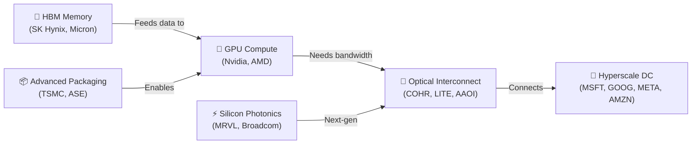

<!-- PROJECT SHIELDS -->
[![Research Status][status-shield]][status-url]
[![Last Updated][updated-shield]][updated-url]
[![Author][author-shield]][author-url]

 

  <h1>Optical Communication & the AI Infrastructure Supercycle</h1>
  

    A sector research memo on optical networking as a stock investment theme, in the context of AI datacenter buildout, memory chips, and silicon photonics.
  

  
<em>Prepared by HX · April 13, 2026</em>

 

---

<!-- TABLE OF CONTENTS -->

  
<strong>Table of Contents</strong>

   
  <ol>
    <li><a href="#executive-summary">Executive Summary</a></li>
    <li>
      <a href="#sector-overview--why-optical-why-now">Sector Overview — Why Optical, Why Now</a>
      <ul>
        <li><a href="#the-ai-bandwidth-problem">The AI Bandwidth Problem</a></li>
        <li><a href="#technology-roadmap">Technology Roadmap</a></li>
        <li><a href="#memory--compute-context">Memory & Compute Context</a></li>
      </ul>
    </li>
    <li>
      <a href="#market--growth-potential">Market & Growth Potential</a>
      <ul>
        <li><a href="#tam">TAM</a></li>
        <li><a href="#growth-drivers">Growth Drivers</a></li>
        <li><a href="#risks">Risks</a></li>
      </ul>
    </li>
    <li><a href="#nvidias-6b-optical-bet--a-watershed-moment">Nvidia's $6B+ Optical Bet</a></li>
    <li>
      <a href="#comparable-companies">Comparable Companies</a>
      <ul>
        <li><a href="#company-profiles">Company Profiles</a></li>
      </ul>
    </li>
    <li>
      <a href="#valuation--return-framework">Valuation & Return Framework</a>
      <ul>
        <li><a href="#current-valuation-landscape">Current Valuation Landscape</a></li>
        <li><a href="#portfolio-construction-approach">Portfolio Construction Approach</a></li>
        <li><a href="#key-metrics-to-monitor">Key Metrics to Monitor</a></li>
      </ul>
    </li>
    <li><a href="#key-questions-for-further-research">Key Questions for Further Research</a></li>
    <li><a href="#recommendation">Recommendation</a></li>
    <li><a href="#sources">Sources</a></li>
  </ol>

 

---

 

## Executive Summary

Optical communication is the physical backbone of the AI infrastructure buildout. Every GPU cluster, every NVLink domain, and every rack-to-rack connection in a modern datacenter depends on high-speed optical transceivers and interconnects. The sector is experiencing a **structural demand inflection** unlike any prior optical cycle.

Three forces are converging simultaneously:

> **1. Technology transition** — The industry is moving from 400G to 800G and 1.6T optical modules, with each GPU generation (Hopper → Blackwell → Rubin) roughly doubling optical bandwidth requirements.
>
> **2. Nvidia validation** — In March 2026, Nvidia committed **$6 billion** in strategic equity investments across Coherent, Lumentum, and Marvell — the single most significant endorsement of the optical sector in its history.
>
> **3. Hyperscaler capex acceleration** — Microsoft, Google, Meta, and Amazon are all expanding AI datacenter footprints with 800G/1.6T optical fabrics. Optical component revenue reached nearly **$25 billion in 2025**.

The optical interconnect market is projected to grow from **$21.9B (2026) to $40B by 2031** at a ~13% CAGR.

**Recommendation:** Overweight the sector via a diversified basket of pure-play optical names (COHR, LITE, AAOI) and optical-adjacent semiconductor plays (MRVL). Ciena (CIEN) and Fabrinet (FN) offer lower-beta exposure. Key risks include tariff escalation, cyclical overbuild, and valuation compression if AI capex decelerates.

 

(<a href="#readme-top">back to top</a>)

---

 

## Sector Overview — Why Optical, Why Now

### The AI Bandwidth Problem

Modern AI training clusters (e.g., Nvidia's GB200 NVL72 and upcoming Rubin architecture) require massive optical bandwidth between GPUs, between racks, and between datacenters. The transition from Hopper to Blackwell GPUs **doubled** optical bandwidth requirements from 400G to 800G per NIC. The next generation (Rubin, expected late 2026) will push demand toward 1.6T and beyond.

This is not incremental growth — it is a **step-function increase** in optical content per server. Each GB200 NVL72 rack requires approximately 2x the optical modules of the prior generation, and AI cluster sizes are scaling from thousands to tens of thousands of GPUs per deployment.

 

### Technology Roadmap

| Generation | Speed | Reach | Form Factor | Status (2026) | Key Suppliers |
|:-----------|:------|:------|:------------|:--------------|:--------------|
| **400G** | 400 Gbps | 500m–2km | QSFP-DD | Mainstream | Innolight, Coherent, AAOI |
| **800G** | 800 Gbps | 500m–2km | OSFP/QSFP-DD | Ramp (primary revenue driver) | Innolight, Coherent, Lumentum |
| **1.6T** | 1.6 Tbps | 500m–2km | OSFP-XD | Early production | Coherent, Lumentum, Broadcom |
| **CPO** | 1.6T+ | On-package | Co-packaged | R&D / early pilot | Broadcom, Marvell, Nvidia |

> [!IMPORTANT]
> **The critical investment insight:** 800G is the primary revenue driver today, but 1.6T is ramping into production in 2026, creating a new product cycle tailwind. Co-packaged optics (CPO) represents the next paradigm shift — integrating optical engines directly onto switch ASICs to reduce power consumption and latency by 50%+.

 

### Memory & Compute Context

Optical communication does not exist in isolation. The AI infrastructure stack includes HBM (high-bandwidth memory), advanced packaging, and custom ASICs — all experiencing parallel supercycles. The optical layer is the **connective tissue**: as GPU compute and HBM capacity scale, the interconnect bandwidth must scale proportionally or become a bottleneck.

This creates a durable, structurally linked demand driver that differentiates optical from typical cyclical semiconductor subsectors.

 

(<a href="#readme-top">back to top</a>)

---

 

## Market & Growth Potential

### TAM

| Segment | 2025/2026 Size | 2030/2031 Target | CAGR |
|:--------|:---------------|:-----------------|:-----|
| Optical Interconnect Market | $21.9B (2026) | $40.0B (2031) | 12.9% |
| Optical Transceiver Segment | $8.4B (2025) | $27.6B (2030) | 16.8% |
| AI-Driven Optical (Hyperscale DC) | ~$4B (2024) | ~$16B (2028) | ~40% |
| Optical Networking Market | $18.9B (2026) | $26.6B (2030) | 8.8% |
| Optical Component Revenue | ~$25B (2025) | — | — |

 

### Growth Drivers

> **GPU Architecture Transitions** — Nvidia's Blackwell → Rubin roadmap doubles optical content per generation. Each new GPU generation creates a product refresh cycle for transceiver vendors.

> **Hyperscaler Capex Acceleration** — Microsoft, Google, Meta, and Amazon are all expanding AI datacenter footprints. High-speed datacom modules (800GbE and 1.6TbE) are the primary growth engine for optical revenue in 2026.

> **Silicon Photonics Maturation** — Marvell's acquisition of Celestial AI (photonic fabric) and integration into NVLink Fusion architecture signals that photonic interconnects are moving from R&D to production.

> **Telecom Coherent Refresh** — 1.2T+ embedded optics are driving a renewed multi-year bandwidth expansion in carrier networks, adding a second growth vector beyond datacenters.

> **Co-Packaged Optics (CPO)** — Broadcom and Nvidia are developing CPO solutions that reduce power per bit by 50%+ in next-gen switch platforms, addressing the approaching gigawatt-scale power consumption of AI datacenters.

 

### Risks

> [!CAUTION]
> Before building exposure, understand these material risks:
>
> - **Cyclical Overbuild** — Optical companies historically experience aggressive capacity buildouts followed by sharp demand declines. The current AI-driven cycle may follow a similar pattern if hyperscaler capex slows.
> - **Tariff Escalation** — The US imposed 104% tariffs on Chinese optical fiber products (April 2025), effectively doubling import costs. Optical fiber prices surged 70%+ from Dec 2025 to Jan 2026. Further escalation could disrupt supply chains.
> - **Customer Concentration** — Many optical companies derive 50–70% of revenue from 3–5 hyperscaler customers. A single capex cut could materially impact earnings.
> - **Valuation Risk** — Several names trade at 40–60x forward P/E, pricing in sustained hypergrowth. Any deceleration signal triggers outsized drawdowns (e.g., COHR 52-week range: $50.81–$310.98).
> - **China Supply Chain** — Innolight (the largest datacom transceiver supplier) is Chinese-listed. Geopolitical decoupling could create short-term supply dislocations even as it advantages US-based suppliers.

 

(<a href="#readme-top">back to top</a>)

---

 

## Nvidia's $6B+ Optical Bet — A Watershed Moment

In March 2026, Nvidia committed **$6 billion** in strategic equity investments across three optical and silicon photonics partners. This is the single most significant validation event for the optical sector in its history.

| Partner | Investment | Date | Strategic Focus |
|:--------|:-----------|:-----|:----------------|
| **Coherent (COHR)** | $2B equity + purchase commitments | March 2026 | AI transceivers, silicon carbide for GPUs |
| **Lumentum (LITE)** | $2B equity + purchase commitments | March 2026 | EMLs, 1.6T optical modules, OCS |
| **Marvell (MRVL)** | $2B equity | March 2026 | Custom ASICs, silicon photonics, NVLink Fusion |

> [!IMPORTANT]
> **Why this matters:** Nvidia is not making portfolio investments — it is **locking in supply** for the Rubin GPU architecture (expected late 2026/early 2027) and the next-generation NVLink Fusion interconnect fabric. These partnerships come with multibillion-dollar purchase commitments, providing revenue visibility that is rare in the optical sector.

For Marvell specifically, the partnership centers on integrating Marvell's custom XPUs and silicon photonics (via the 2025 Celestial AI acquisition) into Nvidia's infrastructure ecosystem. The first **semi-custom reference designs** featuring Marvell's 1.6T optical interconnects with Nvidia's Rubin architecture are expected by **Q3 2026**.

Photonic interconnects can deliver **10–100x higher bandwidth density** than electrical alternatives while consuming significantly less power per bit — essential characteristics as AI datacenters approach gigawatt-scale power consumption.

 

(<a href="#readme-top">back to top</a>)

---

 

## Comparable Companies

| Company (Ticker) | Market Cap | FY26E Revenue | DC/AI % | EPS (Q) | Key Notes |
|:-----------------|:-----------|:--------------|:--------|:--------|:----------|
| **Coherent (COHR)** | $57.6B | ~$6.5B | 72% | $1.29 | Transceivers, lasers, SiC; Nvidia partnership |
| **Lumentum (LITE)** | ~$25B | ~$2.5B | 88% | $1.50+ | EMLs, 1.6T transceivers, OCS; S&P 500 added Mar 2026 |
| **Ciena (CIEN)** | ~$14B | $5.9–$6.3B | ~55% | $4.50+ | Coherent optical systems, WaveLogic 6; telecom + cloud |
| **Applied Opto (AAOI)** | ~$4B | ~$1B | ~80% | ~$1.00 | 400G/800G transceivers; high-growth but volatile |
| **Fabrinet (FN)** | ~$14B | ~$3.2B | ~70% | $9.50+ | Contract mfg for optical; expanding capacity 50% |
| **Marvell (MRVL)** | ~$90B | ~$7B | ~40% | $2.00+ | Custom ASICs, silicon photonics; Nvidia $2B investment |

 

### Company Profiles

 

#### Coherent Corp (COHR) — The AI Optics Leader

Formed from the II-VI / Coherent merger, Coherent is now the broadest optical platform in the industry (transceivers, lasers, silicon carbide, materials).

> - **Q2 FY2026 revenue:** $1.7B (+17.5% YoY). Datacenter & Communications: $1.2B (+33.6% YoY), representing **72% of total revenue**
> - **Market cap:** $57.6B. Nvidia $2B strategic investment announced March 2026
> - **Multiyear supply agreement** with Nvidia for AI transceivers
> - **Bull case:** Vertically integrated laser supply insulates from shortage risk; strongest Nvidia alignment
> - **Bear case:** 52-week range of $50.81–$310.98 reflects extreme volatility; premium valuation

 

#### Lumentum Holdings (LITE) — The EML Monopoly

Dominant supplier of Electro-absorption Modulated Lasers (EMLs) — a critical component in 800G and 1.6T transceivers.

> - **FY26 revenue growth:** +58% YoY. Q2 FY2026 revenue: $665.5M (+65.5% YoY). Cloud & Networking: **88% of total revenue**
> - **Added to the S&P 500** in March 2026, creating structural index fund buying pressure
> - **Nvidia $2B strategic investment;** targeting $780–$830M in Q3 FY2026 revenue (~85% YoY growth)
> - **Bull case:** Near-monopoly on EMLs; S&P 500 inclusion; strongest revenue growth trajectory
> - **Bear case:** Customer concentration; EML technology could be displaced by silicon photonics long-term

 

#### Ciena (CIEN) — Coherent Systems Backbone

Leading provider of coherent optical networking systems (WaveLogic 6 platform). More telecom-exposed than peers but growing cloud/AI share.

> - **FY2026 guidance raised** to $5.9–$6.3B. ~55% datacenter/cloud exposure, growing
> - **Bull case:** Lower valuation vs. pure-play optical; telecom recovery + cloud growth dual catalyst
> - **Bear case:** Telecom carrier spending is cyclical and vulnerable to macro; less direct AI exposure than COHR/LITE

 

#### Applied Optoelectronics (AAOI) — High-Beta AI Play

Pure-play 400G/800G transceiver maker targeting $1B+ revenue in 2026.

> - **Trades at ~6.7x P/S** — elevated but lower than COHR/LITE
> - **Bull case:** Highest revenue growth rate; pure datacenter exposure; potential acquisition target
> - **Bear case:** Smallest scale; customer concentration risk; historically volatile earnings

 

#### Fabrinet (FN) — The Optical "Arms Dealer"

Contract manufacturer for optical transceivers — benefits from sector growth regardless of which transceiver vendor wins.

> - **Expanding capacity by 50%** (new 2M sq ft facility), representing ~$2.4B in additional annual revenue potential
> - **Bull case:** Diversified customer base; "pick-and-shovel" play with lower technology risk
> - **Bear case:** Contract manufacturing margins are lower than component margins; capacity expansion may take 12–18 months to ramp

 

#### Marvell Technology (MRVL) — Silicon Photonics Convergence

Custom ASIC and silicon photonics leader; 2025 acquisition of Celestial AI added photonic fabric technology.

> - **Nvidia $2B investment** for NVLink Fusion — integrating Marvell's 1.6T optical interconnects with Rubin GPU architecture
> - **~40% datacenter/AI revenue mix,** growing rapidly. Market cap ~$90B
> - **Bull case:** Bridges the gap between semiconductor and optical; deepest Nvidia integration on the ASIC side
> - **Bear case:** Competes with Broadcom in custom ASICs; optical is still a smaller portion of total revenue

 

(<a href="#readme-top">back to top</a>)

---

 

## Valuation & Return Framework

### Current Valuation Landscape

The optical sector trades at a significant premium to the broader semiconductor space, reflecting AI-driven growth expectations. Forward P/E ratios range from **~25x (Ciena)** to **50–60x (Coherent, Lumentum)**. These valuations are supported by 30–65% revenue growth rates but leave limited room for execution misses.

 

### Portfolio Construction Approach

| Allocation | Ticker(s) | Role | Rationale |
|:-----------|:----------|:-----|:----------|
| **Core (60%)** | COHR + LITE | Direct AI exposure | Nvidia partnership, highest growth, strongest moats |
| **Growth Satellite (15%)** | AAOI | High-beta upside | Pure datacenter, potential M&A target; size smaller due to volatility |
| **Diversified (15%)** | FN | Pick-and-shovel | Benefits from any optical vendor's success |
| **Adjacent (10%)** | MRVL | Silicon photonics bridge | Custom ASIC + optical convergence; broader than pure optical |

 

### Key Metrics to Monitor

1. **800G/1.6T transceiver shipment volumes** — quarterly, from earnings calls and LightCounting data
2. **Hyperscaler capex guidance** — Microsoft, Google, Meta, Amazon quarterly earnings
3. **Nvidia GPU architecture transition timelines** — Blackwell ramp, Rubin launch date
4. **Tariff policy developments** on Chinese optical components
5. **Gross margin trends** — expansion signals pricing power; compression signals oversupply
6. **Co-packaged optics (CPO) adoption timeline** — a potential disruptor to traditional pluggable transceiver business models

 

(<a href="#readme-top">back to top</a>)

---

 

## Key Questions for Further Research

- How defensible is Lumentum's EML position against silicon photonics alternatives from Marvell/Broadcom?
- What is the realistic timeline for CPO to displace pluggable transceivers, and which companies are best positioned for the transition?
- How exposed are Coherent and Lumentum to a potential Nvidia capex slowdown if AI model training efficiency improves (i.e., less compute needed per model)?
- What is the tariff impact on Innolight's competitive position, and does this structurally benefit US-based optical suppliers?
- Are current optical sector valuations discounting 2–3 years of growth, and what would trigger a de-rating?
- How does the optical sector correlate with HBM and advanced packaging cycles — are they leading or lagging indicators for each other?

 

(<a href="#readme-top">back to top</a>)

---

 

## Recommendation

**Overweight the optical communication sector** within an AI infrastructure portfolio. The convergence of Nvidia's $6B strategic investment, the 800G-to-1.6T transition, and hyperscaler capex acceleration creates a multi-year structural growth opportunity that is fundamentally different from prior optical cycles.

However, the sector is not without risks. Valuations are stretched, tariff dynamics are fluid, and the cyclical nature of optical demand means that any deceleration in hyperscaler spending could trigger sharp corrections. Position sizing should reflect this volatility — the optical basket should be a meaningful but not dominant allocation within a broader AI infrastructure thesis that also includes compute (Nvidia, AMD), memory (SK Hynix, Micron), and networking (Arista, Broadcom).

**Next steps:**

1. Build detailed DCF models for COHR and LITE using Q3 FY2026 guidance
2. Monitor OFC 2026 conference for CPO adoption signals
3. Track tariff policy developments on Chinese optical imports
4. Evaluate entry points on any macro-driven pullbacks

 

> [!NOTE]
> The optical sector should be viewed as part of a broader AI infrastructure allocation — not a standalone bet. The strongest risk-adjusted returns come from pairing optical exposure with positions in compute (NVDA), memory (MU, SK Hynix), and networking infrastructure (ANET).

 

(<a href="#readme-top">back to top</a>)

---

 

## Sources

- [Cignal AI — Optical Component Revenue Reaches Nearly $25B in 2025 (Jan 2026)](https://cignal.ai/2026/01/optical-component-revenue-reaches-nearly-25b-in-2025/)
- [Mordor Intelligence — Optical Interconnect Market Size, Outlook 2026–2031](https://www.mordorintelligence.com/industry-reports/optical-interconnect-market)
- [Coherent Corp — Q2 FY2026 Earnings Release (Feb 4, 2026)](https://www.coherent.com/news/press-releases/second-quarter-fiscal-year-2026-results)
- [Futurum Group — Coherent Q2 FY 2026: AI Datacenter Demand Lifts Revenue and Margins](https://futurumgroup.com/insights/coherent-q2-fy-2026-ai-datacenter-demand-lifts-revenue-and-margins/)
- [Seeking Alpha — Top 5 Stocks for AI's Optical Revolution in 2026](https://seekingalpha.com/article/4889217-top-5-stocks-for-ais-optical-revolution-in-2026)
- [Yahoo Finance — Coherent's OFC 2026 AI Optics and Nvidia Deal](https://finance.yahoo.com/markets/stocks/articles/coherent-ofc-2026-ai-optics-090643150.html)
- [Nvidia's $4B Photonics Play: Lumentum vs Coherent (2026)](https://tech-insider.org/nvidia-silicon-photonics-lumentum-coherent-ai-data-center-2026/)
- [Nvidia's $2 Billion Marvell Bet — Intellectia](https://intellectia.ai/blog/nvidia-marvell-2-billion-investment-ai-infrastructure-2026)
- [Benzinga — Wall Street Unveils AI Winners: Arista and Ciena Lead](https://www.benzinga.com/markets/tech/26/03/51167909/wall-street-unveils-ai-winners-arista-and-ciena-lead-a-multi-billion-dollar-backbone-explosion)
- [IndexBox — OFC 2026: AI Drives Optical Interconnect & CPO Shift](https://www.indexbox.io/blog/ofc-2026-optical-interconnects-dominate-ai-data-center-future/)
- [MarketsandMarkets — US Tariffs Impact on Fiber Optic Components Market](https://www.marketsandmarkets.com/ResearchInsight/us-tariff-impact-fiber-optic-component-market.asp)
- [The Business Research Company — Optical Communication and Networking Equipment Market Report 2026](https://www.thebusinessresearchcompany.com/report/optical-communication-and-networking-equipment-global-market-report)
- [Fortune Business Insights — Optical Communication Systems and Networking Market to 2034](https://www.fortunebusinessinsights.com/optical-communication-systems-and-networking-market-106620)
- [Zacks — Is Coherent's Product Range Positioning It as a Premium AI Asset?](https://www.zacks.com/stock/news/2896598/is-coherents-product-range-positioning-it-as-a-premium-ai-asset)
- [Yahoo Finance — Co-Packaged Optics Market Report 2026–2036](https://finance.yahoo.com/news/co-packaged-optics-market-report-090200341.html)

 

---

  This document is for informational and educational purposes only. It does not constitute financial advice. Always do your own research before making investment decisions.

 

(<a href="#readme-top">back to top</a>)

<!-- MARKDOWN LINKS & IMAGES -->
[status-shield]: https://img.shields.io/badge/Status-Active_Research-brightgreen?style=for-the-badge
[status-url]: #executive-summary
[updated-shield]: https://img.shields.io/badge/Last_Updated-April_2026-blue?style=for-the-badge
[updated-url]: #comparable-companies
[author-shield]: https://img.shields.io/badge/Author-HX-orange?style=for-the-badge
[author-url]: https://github.com/goodybooy
